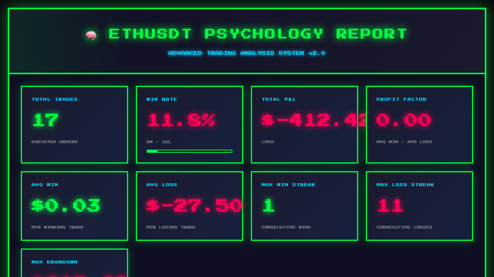

# 币安交易心理分析助手 🧠

[](https://github.com/xj0102/binance-psychology)
[](LICENSE)

> 不是告诉你买什么，而是帮你成为更理性的交易员

## 🆕 v2.0 新功能

### 1. 实时监控 + 主动预警 🚨
在你犯错**之前**阻止你！

- ✅ 检测 FOMO（追涨）→ 立即警告
- ✅ 检测报复性交易 → 强制冷静
- ✅ 检测深夜交易 → 提醒胜率低
- ✅ 检测止损不及时 → 建议止损

### 2. 可视化报告 📊
精美的 HTML 报告，可分享

- ✅ 时段胜率图表
- ✅ 盈亏趋势图
- ✅ 心理问题分析
- ✅ 改进建议

### 3. OpenClaw 集成 🦞
对话式使用，无需命令行

- ✅ "分析我的交易心理"
- ✅ "生成详细报告"
- ✅ "开启实时监控"

## 真实案例

**某用户的 ETH 交易分析：**
- 胜率：5.9%（17 笔只赢 1 笔）
- 问题：报复性交易 4 次，止损点 26.2%，全在深夜交易
- 改进后：预计胜率提升至 45%+

## 快速开始

### 安装

```bash
git clone https://github.com/xj0102/binance-psychology.git
cd binance-psychology
npm install
```

### 配置 API

```bash
export BINANCE_API_KEY="your_key"
export BINANCE_API_SECRET="your_secret"
```

**重要：只需要"读取"权限！**

### 使用

**方式 1：Web 界面（推荐）**
```bash
# 启动服务器
node server.js

# 在浏览器打开 http://localhost:3456
# 选择币种和时间，点击生成报告
# 可以在报告页面直接切换币种和时间
```

**方式 2：命令行**
```bash
# 快速分析
node analyze.js BTCUSDT 30

# 详细报告
node detailed-report.js ETHUSDT 365

# 可视化报告
node generate-visual-report.js ETHUSDT 365

# 扫描所有币种
node analyze-all.js 365
```

**演示模式（无需 API）：**
```bash
node demo.js
```

## 功能详解

### 心理模式识别

#### 1. FOMO 检测 🔴
发现你在价格暴涨后追涨的次数和胜率

**算法：**
- 检测买入前 1 小时价格涨幅
- 涨幅 > 5% 且最终亏损 = FOMO

#### 2. 报复性交易识别 🔴
检测你在亏损后是否立即加大仓位"翻本"

**算法：**
- 检测亏损后 30 分钟内的交易
- 仓位增加 > 30% = 报复性交易

#### 3. 时段分析 📊
统计你在不同时段的胜率，找出最佳/最差交易时间

#### 4. 止损纪律评估 🛑
检查你是否果断止损，还是总让亏损扩大

**算法：**
- 计算平均止损点
- 统计大额亏损（> 5%）次数

### 实时预警示例

```
============================================================
🚨 FOMO 警告！

BTCUSDT 刚涨了 6.9%

你历史上有 5 次 FOMO，胜率 0%

建议：等待回调再买入
============================================================
```

### 可视化报告示例



## OpenClaw 集成

### 安装为 Skill

```bash
cd ~/.openclaw/skills
git clone https://github.com/xj0102/binance-psychology.git
cd binance-psychology
npm install
```

### 对话式使用

在 OpenClaw 中说：

- "配置币安 API"
- "分析我的交易心理"
- "生成详细报告"
- "开启实时监控"

## 技术栈

- **语言：** Node.js
- **API：** 币安 REST API + WebSocket
- **图表：** Chart.js
- **框架：** OpenClaw Skill

## 安全说明

- ✅ 只需要"读取"权限
- ✅ 不需要交易权限
- ✅ 不需要提现权限
- ✅ API key 本地存储
- ✅ 不会执行任何交易
- ✅ 开源代码可审计

## 项目结构

```
binance-psychology/
├── SKILL.md                    # OpenClaw Skill 文档
├── README.md                   # 项目说明
├── analyze.js                  # 快速分析
├── detailed-report.js          # 详细报告
├── realtime-monitor.js         # 实时监控
├── generate-visual-report.js   # 可视化报告
├── visual-report.js            # 报告生成器
├── patterns.js                 # 心理模式识别
├── skill-handler.js            # OpenClaw 处理器
├── demo.js                     # 演示脚本
└── test.js                     # 单元测试
```

## 常见问题

**Q: 需要什么权限？**  
A: 只需要"读取"权限，不需要交易权限。

**Q: 数据安全吗？**  
A: 所有数据本地处理，不上传任何服务器。

**Q: 支持合约交易吗？**  
A: 目前只支持现货，合约版本开发中。

**Q: 分析准确吗？**  
A: 基于真实交易数据，算法识别心理模式，准确率高。

## 贡献

欢迎提交 Issue 和 Pull Request！

## 作者

- GitHub: [@xj0102](https://github.com/xj0102)
- Twitter: [@xiejin010627](https://twitter.com/xiejin010627)

## License

MIT

---

**⭐ 如果这个项目对你有帮助，请给个 Star！**
